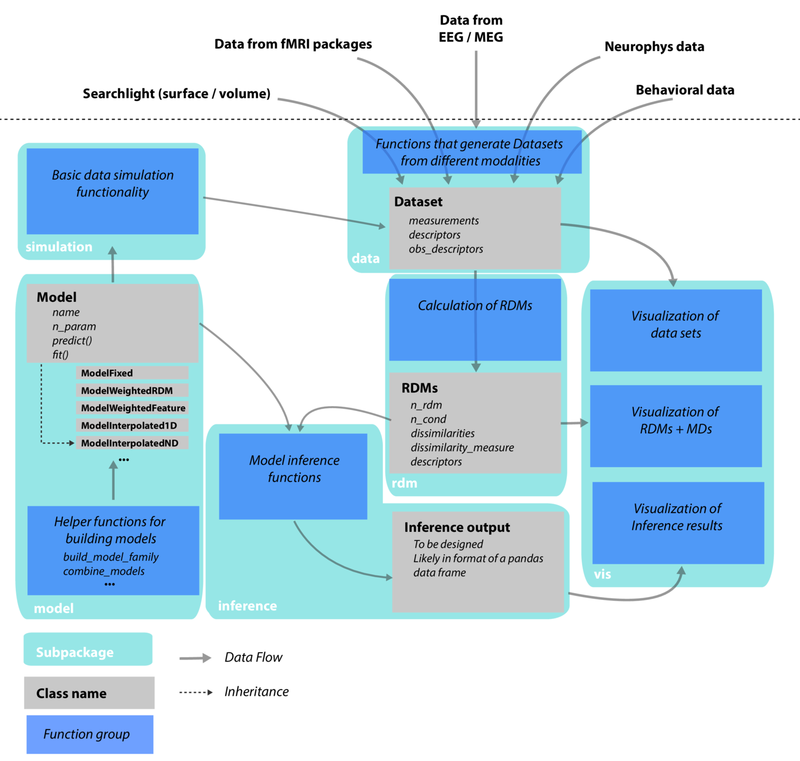

.. _overview:

Toolbox overview
================

    *Overview over subpackages and data flow in PyRSA.*

Describe steps in a typical RSA analysis 

* Put together data set 
* Calculate the RDM  
* Define models  
* Compare data to models  
* Visualize results
* Advanced: Test inference with simulations

