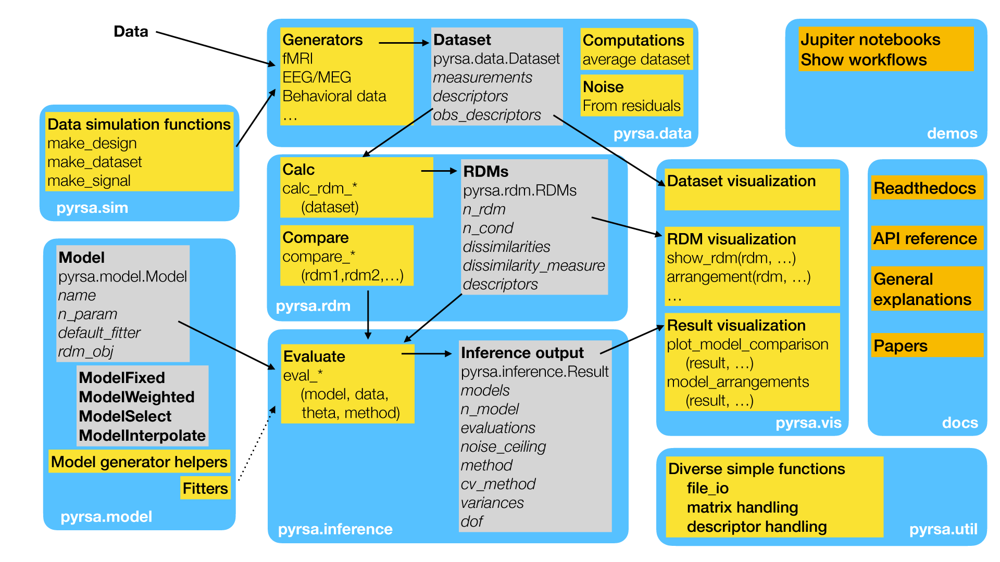

.. _overview:

Toolbox overview
================

    *Overview over subpackages and work flow in PyRSA.*

The Figure above shows the most important subpackages (blue), classes (gray), modules (yellow) and auxillary materials (orange) of the pyrsa toolbox.
A common use of the pyrsa toolbox involves the following steps:

* Extract the data that you want to analyzed. The data is stored in the format of a ``pyrsa.data.Dataset`` object, see :ref:`datasets`.
* Use functions from the module ``pyrsa.rdm.calc`` to calculate a RDM from the data, with many options for different dissimilarity measures, see :ref:`distances`.
* Define RSA models by defining objects of the ``pyrsa.model`` class. For information on the different model types, see :ref:`model`.
* Models can be fitted to the data and then evaluated using the ``pyrsa.inference.evaluate`` module. Results of the evaluation is stored in a ``pyrsa.inference.results`` object.
* Dataset, RDMs, Models, and results can be visualized using the ``pyrsa.vis`` subpackage.
* For simulation of artificial data sets, you can used the ``pyrsa.sim.simulation`` module.

For an example of a complete workflow, see the "getting started with RSA3.0" Notebook, :ref:`demos`.